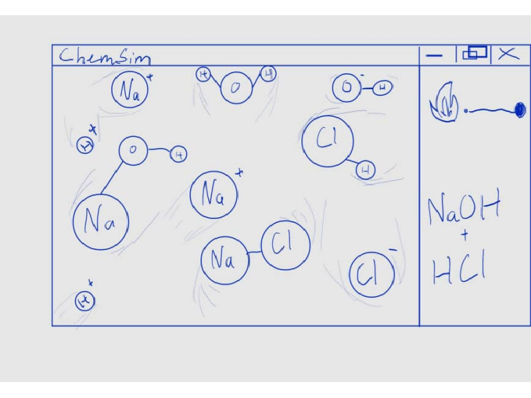
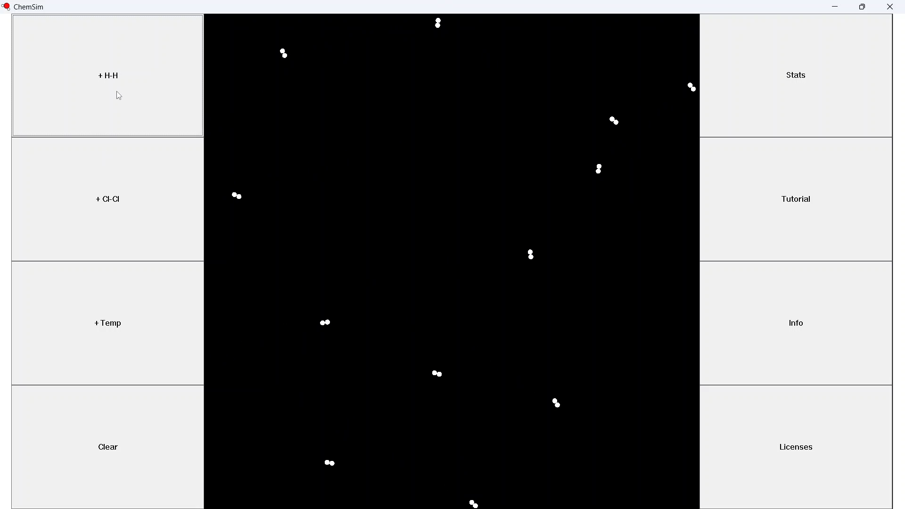
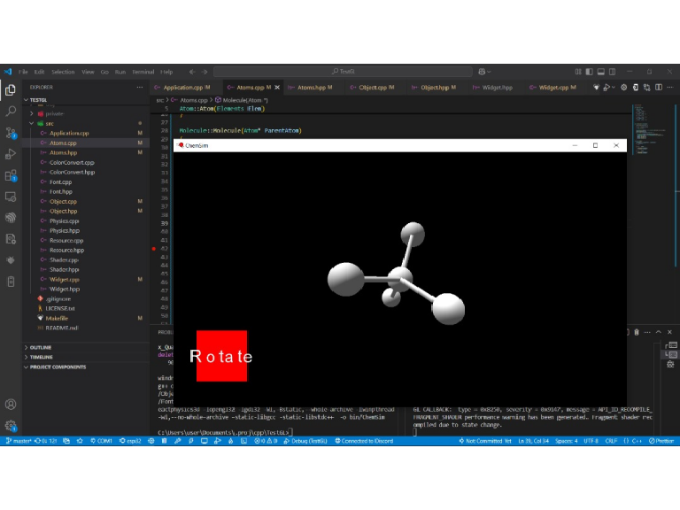
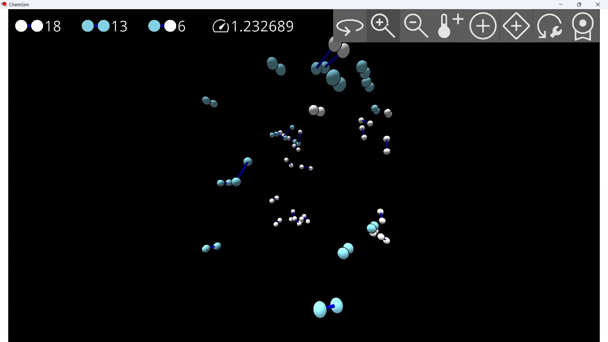

# ChemSim
This project is meant to help students and teachers. It is used to visualise what happened during a chemical reaction to give a deeper understanding.

## >>>[Windows](https://github.com/Zak2012/ChemSim/releases)
## >>>[Web](https://zak-sm2012.itch.io/chemsim)

## Process
-Sketch

</img>

- V1

</img>

- 3D test

</img>

- V2

</img>

### Minimum Req
- 32 bit cpu
- windows 7
- opengl 3.3

### Libraries used
- FreeType
- GLEW
- GLFW
- GLM
- OpenGL
- Rectpack2D
- STB
- Emscripten
- tinyxml2